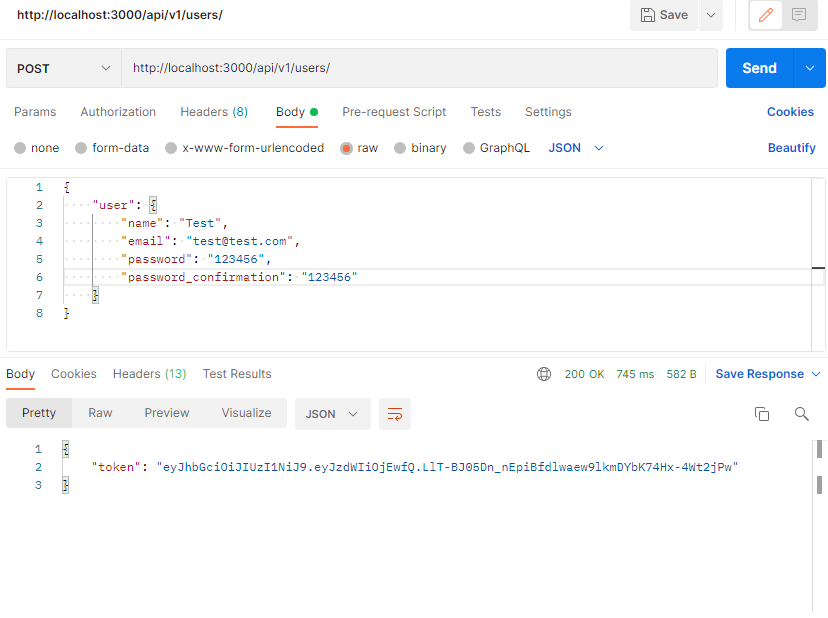
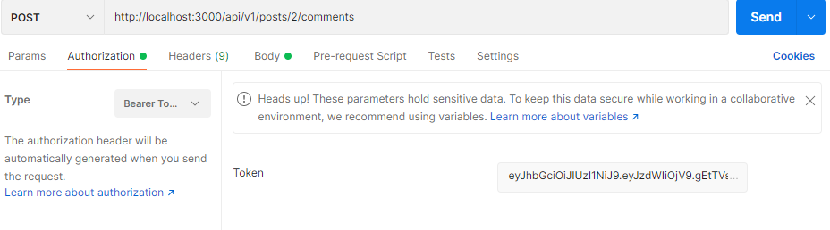
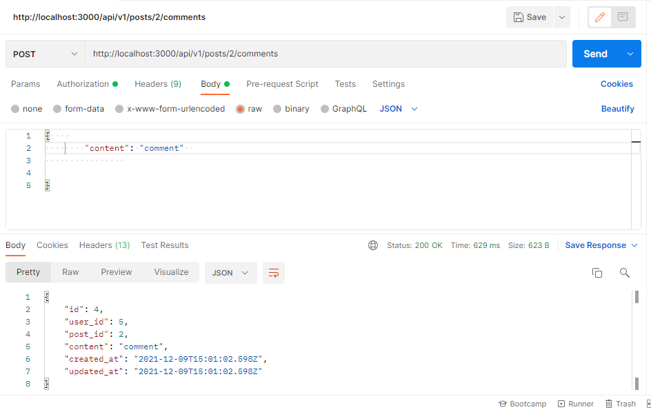

# Scaffold for social media app with Ruby on Rails

> This repo includes intial code for social media app with basic styling. Its purpose is to be a starting point for Microverse students.


## Built With

- Ruby v2.7.2
- Ruby on Rails v6.0.3
- RubyMine
- GitHub
- Heroku
- PostgreSQL

## Linters

- Rubocop
- Stylelint

## Live Demo

## [Live Preview](https://api-social-microverse.herokuapp.com/)


## Getting Started

To get a local copy up and running follow these simple example steps.

### Prerequisites

- Ruby: v2.7.2
- Rails: v6.0.3 
- Postgres: >=9.5

### Setup

Instal gems with:

```
bundle install
```

Setup database with:

```
rails db:create
rails db:migrate
```

### Usage

Start server with:

```
rails server
```

Open `http://localhost:3000/` in your browser.

### Run tests

```
rpsec --format documentation
```

## API Endpoints

> List all posts

```http://localhost:3000/api/v1/posts```

> List comments for given post

```http://localhost:3000/api/v1/posts/:post_id/comments```

> To create comments you must first create a user, can create the user with the API.

 ```http://localhost:3000/api/v1/users```

 

> Copy the provided token and paste it into Authorization section for Beaver Token



> And finally can create a new comment with the POST method sending the comment as JSON 
 
```http://localhost:3000/api/v1/posts/:post_id/comments```




### Deployment

# [Live version]()

## Authors

## 👨🏻‍💻 Kenny Ortega

- GitHub: [kensayo](https://github.com/kensayo)
- Twitter: [@kensayo](https://twitter.com/kensayo)
- LinkedIn: [LinkedIn](https://www.linkedin.com/in/kennyortega/)

## 👨🏻‍💻 Sunny Díaz

- GitHub: [@SunnySparks](https://github.com/SunnySparks)
- Twitter: [@JosfranT6](https://twitter.com/JosFranT6)
- Instagram: [@webdev.sunnydiaz](https://www.instagram.com/webdev.sunnydiaz/)
- Portfolio: [sunnydiaz.com](https://sunnydiaz.com/)
- LinkedIn: [LinkedIn](https://www.linkedin.com/in/jose-f-silva/)

## 👩‍💻 Rocio Martinez
- Github: [@Rocio01](https://github.com/Rocio01)
- Twitter: [@rugiada8801](https://twitter.com/rugiada8801)
- Linkedin: [zulma-rocio-martinez](https://www.linkedin.com/in/zulma-rocio-martinez)


## 🤝 Contributing

Contributions, issues and feature requests are welcome!

Feel free to check the [issues page](issues/).

## Show your support

Give a ⭐️ if you like this project!

